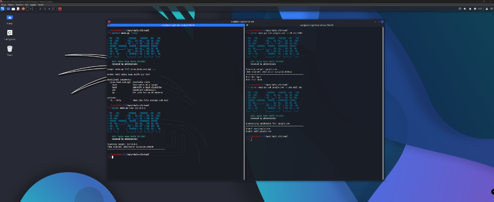

# K-SAK: Kali Swiss Army Knife CLI Tool

K-SAK is a versatile, multi-purpose command-line interface tool designed for Kali Linux (and other security-focused environments). It centralizes several essential reconnaissance and security modules into a single, easy-to-use application.



## 🚀 Features

- **Network Scanner**: Fast port scanning to identify open services on a target.
- **Subdomain Enumerator**: Discover subdomains for a given domain using a customizable wordlist.
- **Hash Identifier**: Instantly identify common hashing algorithms (MD5, SHA-1, SHA-256, etc.) based on their signature.
- **IP Informer**: Retrieve geolocation, ISP, and organizational data for any IP address.

## 🛠️ Installation

1. **Clone the repository**:

   ```bash
   git clone https://github.com/p0is0n3r404/-kali-cli-tool.git
   cd -kali-cli-tool
   ```

2. **Install dependencies**:
   ```bash
   pip install -r requirements.txt
   ```

## 📖 Usage

Run the tool using `python main.py` followed by the desired command.

### 1. Port Scan

Scan a target for open ports (default ports: 21, 22, 80, 443, 3306, 8080).

```bash
python main.py scan 127.0.0.1
```

Specify custom ports:

```bash
python main.py scan google.com -p 80 443 8080
```

### 2. Hash Identification

Identify the algorithm used for a specific hash string.

```bash
python main.py hash 5d41402abc4b2a76b9719d911017c592
```

### 3. Subdomain Enumeration

Find subdomains using a wordlist.

```bash
python main.py sub example.com -w www mail dev
```

### 4. IP Information

Get detailed info about an IP address.

```bash
python main.py ip 8.8.8.8
```

## 📂 Project Structure

- `main.py`: Main entry point and CLI logic.
- `modules/`: Contains core functionality for scanning, hashing, and enumeration.
- `requirements.txt`: Python package dependencies.

## ⚠️ Disclaimer

This tool is for educational and ethical testing purposes only. Usage of K-SAK for attacking targets without prior mutual consent is illegal. It is the end user's responsibility to obey all applicable local, state, and federal laws.

---

Developed by [p0is0n3r404](https://github.com/p0is0n3r404)
