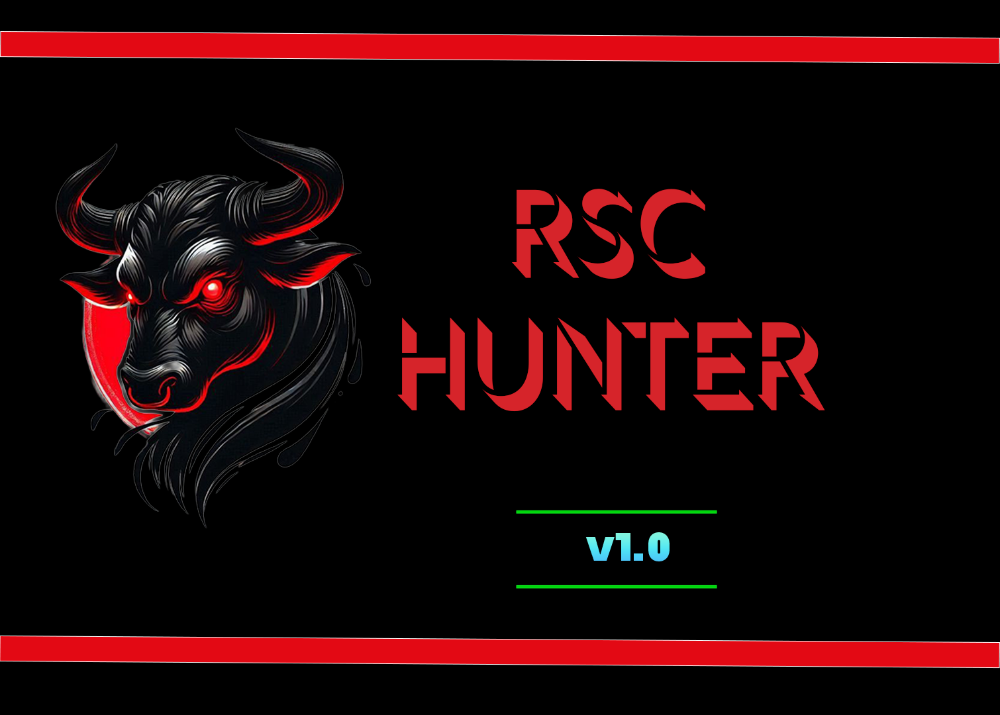

<div align="center">
  
  
  # RSC-Hunter
  
  **Next.js RCE Scanner for CVE-2025-55182 & CVE-2025-66478**
  
  [](https://www.python.org/downloads/)
  [](LICENSE)
  
</div>

---

## 📖 Overview

RSC-Hunter is a professional, modular command-line tool for detecting **CVE-2025-55182** and **CVE-2025-66478** vulnerabilities in Next.js applications using React Server Components.

For technical details on the vulnerability and detection methodology, see the [Assetnote blog post](https://slcyber.io/research-center/high-fidelity-detection-mechanism-for-rsc-next-js-rce-cve-2025-55182-cve-2025-66478).

## ✨ Features

- 🎯 **High-Fidelity Detection** - RCE PoC and safe side-channel methods
- 🛡️ **WAF Bypass** - Multiple evasion techniques including Vercel-specific bypasses
- 🚀 **Multi-threaded** - Fast concurrent scanning
- 🎨 **Rich Terminal UI** - Beautiful, colored output with progress bars
- 📊 **Flexible Output** - JSON reports with full request/response data
- 🪟 **Cross-Platform** - Windows and Unix payload support

## 🔧 How It Works

By default, RSC-Hunter sends a crafted multipart POST request containing an RCE proof-of-concept payload that executes a deterministic math operation (`41*271 = 11111`). Vulnerable hosts return the result in the `X-Action-Redirect` response header as `/login?a=11111`.

The scanner tests the root path first. If not vulnerable, it follows same-host redirects (e.g., `/` to `/en/`) and tests the redirect destination. Cross-origin redirects are not followed.

### 🔒 Safe Check Mode

The `--safe-check` flag uses an alternative detection method that relies on side-channel indicators (500 status code with specific error digest) without executing code on the target. Use this mode when RCE execution is not desired.

### 🧱 WAF Bypass

The `--waf-bypass` flag prepends random junk data to the multipart request body. This can help evade WAF content inspection that only analyzes the first portion of request bodies. The default size is 128KB, configurable via `--waf-bypass-size`.

### ☁️ Vercel WAF Bypass

The `--vercel-waf-bypass` flag uses an alternative payload variant specifically designed to bypass Vercel WAF protections.

### 🪟 Windows Mode

The `--windows` flag switches the payload from Unix shell (`echo $((41*271))`) to PowerShell (`powershell -c "41*271"`) for targets running on Windows.

## 📦 Installation

### Requirements
- Python 3.9+
- pip

### Setup

```bash
# Clone the repository
git clone https://github.com/p0is0n3r404/RSC-Hunter.git
cd RSC-Hunter

# Create virtual environment (recommended)
python -m venv env
source env/bin/activate  # On Windows: env\Scripts\activate

# Install dependencies
pip install -r requirements.txt
```

## 🚀 Usage

### Basic Scan

```bash
python -m rsc_hunter.cli -u "https://example.com"
```

### Safe Check (No RCE)

```bash
python -m rsc_hunter.cli -u "https://example.com" --safe-check
```

### Batch Scanning

```bash
python -m rsc_hunter.cli -l hosts.txt -t 20 -o results.json
```

### Advanced Options

```bash
# Scan with custom headers
python -m rsc_hunter.cli -u "https://example.com" -H "Authorization: Bearer token"

# Windows target
python -m rsc_hunter.cli -u "https://example.com" --windows

# WAF bypass
python -m rsc_hunter.cli -u "https://example.com" --waf-bypass

# Vercel WAF bypass
python -m rsc_hunter.cli -u "https://example.com" --vercel-waf-bypass

# Verbose output
python -m rsc_hunter.cli -u "https://example.com" -v
```

## 📋 Options

| Option | Description |
|--------|-------------|
| `-u, --url` | Single URL/host to check |
| `-l, --list` | File containing hosts (one per line) |
| `-t, --threads` | Number of concurrent threads (default: 10) |
| `--timeout` | Request timeout in seconds (default: 10) |
| `-o, --output` | Output file for results (JSON) |
| `--all-results` | Save all results, not just vulnerable hosts |
| `-k, --insecure` | Disable SSL certificate verification |
| `-H, --header` | Custom header (can be used multiple times) |
| `-v, --verbose` | Show response details for vulnerable hosts |
| `-q, --quiet` | Only output vulnerable hosts |
| `--no-color` | Disable colored output |
| `--safe-check` | Use safe side-channel detection instead of RCE PoC |
| `--windows` | Use Windows PowerShell payload |
| `--waf-bypass` | Add junk data to bypass WAF (default: 128KB) |
| `--waf-bypass-size` | Size of junk data in KB (default: 128) |
| `--vercel-waf-bypass` | Use Vercel WAF bypass payload variant |

## 📁 Project Structure

```
rsc-hunter/
├── rsc_hunter/
│   ├── cli.py              # Entry point & argument parsing
│   ├── core/
│   │   ├── network.py      # Request handling, redirects
│   │   └── scanner.py      # Vulnerability check logic
│   ├── payloads/
│   │   ├── rce.py          # RCE payloads (Unix/Windows)
│   │   ├── safe.py         # Safe check payloads
│   │   └── bypass.py       # WAF bypass logic
│   └── utils/
│       ├── banners.py      # ASCII Art
│       ├── colors.py       # Terminal colors
│       └── output.py       # Reporting & Rich UI
├── images/
│   └── react-scanner-logo.png
├── requirements.txt
├── README.md
└── scanner.py              # Legacy version (deprecated)
```

## 📊 Output

Results are printed to the terminal with color-coded status indicators. When using `-o`, vulnerable hosts are saved to a JSON file containing the full HTTP request and response for verification.

### Example Output

```
RSC-Hunter - Next.js RCE Scanner
based on research from Assetnote

[*] Loaded 1 host(s) to scan
[*] Using 10 thread(s)
[*] Timeout: 10s

[NOT VULNERABLE] https://example.com - Status: 200

============================================================
SCAN SUMMARY
============================================================
  Total hosts scanned: 1
  Vulnerable: 0
  Not vulnerable: 1
  Errors: 0
============================================================
```

## 🙏 Credits

The RCE PoC was originally disclosed by [@maple3142](https://x.com/maple3142) -- we are incredibly grateful for their work in publishing a working PoC.

This tooling originally was built out as a safe way to detect the RCE. This functionality is still available via `--safe-check`, the "safe detection" mode.

- **Assetnote Security Research Team** - [Adam Kues, Tomais Williamson, Dylan Pindur, Patrik Grobshäuser, Shubham Shah](https://x.com/assetnote)
- [xEHLE_](https://x.com/xEHLE_) - RCE output reflection in resp header
- [Nagli](https://x.com/galnagli)

## ⚖️ License

This project is licensed under the MIT License - see the [LICENSE](LICENSE) file for details.

## ⚠️ Disclaimer

This tool is for **authorized security testing only**. Unauthorized access to computer systems is illegal. Always obtain proper authorization before testing.

---

<div align="center">
  Made with ❤️ for the security community
</div>
